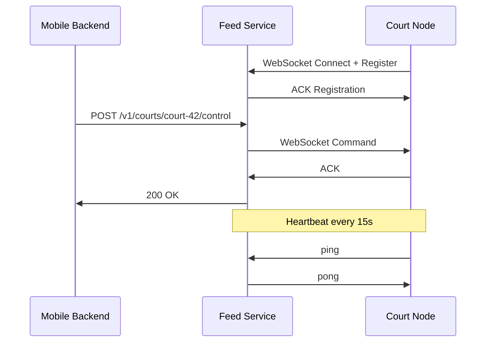

# Feed Starter Service

A lean Node.js microservice that bridges mobile app backends with on-court edge PCs for live streaming and video capture control via WebSockets.

## 🏗️ Architecture

```
Mobile App Backend ──REST──> Feed Starter Service ──WebSocket──> Court Edge PCs
                              │
                              └──SSE──> Admin Dashboard (events)
```

## 🚀 Quick Start

### Prerequisites

- Node.js v20+
- npm/yarn

### Installation

```bash
npm install
cp .env.example .env
# Edit .env with your configuration
npm run dev
```

### Production

```bash
npm start
```

## 🌍 Environment Variables

| Variable                | Description                  | Default         |
| ----------------------- | ---------------------------- | --------------- |
| `PORT`                  | Server port                  | `3000`          |
| `NODE_ENV`              | Environment                  | `development`   |
| `COURT_NODES_ALLOWED`   | Comma-separated auth tokens  | `token1,token2` |
| `WS_HEARTBEAT_INTERVAL` | Heartbeat interval (ms)      | `15000`         |
| `WS_HEARTBEAT_TIMEOUT`  | Heartbeat timeout (ms)       | `5000`          |
| `CONTROL_ACK_TIMEOUT`   | Control command timeout (ms) | `3000`          |

## 📡 API Reference

### WebSocket Endpoint

- **URL**: `ws://localhost:3000/ws`
- **Purpose**: Court nodes connect here

#### Court Node Registration

```json
{
  "courtId": "court-42",
  "capabilities": ["live", "record"],
  "authToken": "your-auth-token"
}
```

#### Control Commands (Service → Court)

```json
{
  "cmd": "START_RECORD",
  "by": "user-uuid",
  "meta": { "quality": "1080p", "duration": 3600 }
}
```

### REST API

#### Control Court

```
POST /v1/courts/:courtId/control
Content-Type: application/json

{
  "action": "start|stop",
  "userId": "uuid",
  "source": "mobile|admin",
  "meta": { "quality": "1080p", "duration": 3600 }
}
```

**Responses:**

- `200 OK` - Command acknowledged by court
- `404 Not Found` - Court not connected
- `422 Unprocessable Entity` - Invalid request body
- `504 Gateway Timeout` - Court didn't acknowledge within 3s

#### Server-Sent Events

```
GET /v1/events
Accept: text/event-stream
```

**Event Types:**

- `court-status` - Court connection/disconnection
- `court-heartbeat` - Periodic court health updates

## 🔄 Sequence Diagram



## 🧪 Testing

```bash
# Run all tests
npm test

# Watch mode
npm run test:watch

# Linting
npm run lint
npm run lint:fix

# Formatting
npm run format
```

## 🛠️ Development

### Project Structure

```
src/
├── app.js              # Express app initialization
├── config.js           # Environment configuration
├── ws/
│   ├── registry.js     # Court socket registry
│   └── handlers.js     # WebSocket message handlers
├── routes/
│   └── control.js      # REST API routes
├── utils/
│   └── logger.js       # Pino logger setup
└── tests/
    ├── integration/    # End-to-end tests
    └── unit/          # Unit tests
```

### Key Features

- ✅ ES Modules with Node v20
- ✅ WebSocket court registry with heartbeat
- ✅ REST to WebSocket command bridge
- ✅ Server-sent events for real-time updates
- ✅ Request validation with Zod
- ✅ Structured logging with Pino
- ✅ Security headers with Helmet
- ✅ Rate limiting and CORS
- ✅ Graceful shutdown handling
- ✅ Comprehensive test coverage

### Debug Mode

```bash
DEBUG=ws:* npm run dev
```

## 🔒 Security

- Auth tokens validated against whitelist
- Rate limiting on REST endpoints
- CORS configured for specific origins
- Security headers via Helmet
- Request/response sanitization

## 📈 Monitoring

The service exposes health metrics and logs in JSON format for easy integration with monitoring systems.

## 🤝 Contributing

1. Fork the repository
2. Create a feature branch
3. Make your changes
4. Run tests and linting
5. Submit a pull request

## 📄 License

MIT License - see LICENSE file for details
